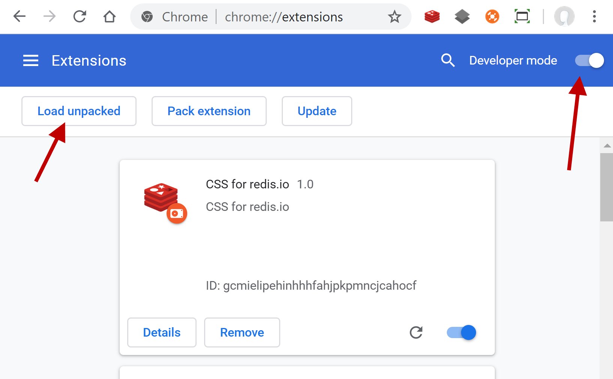
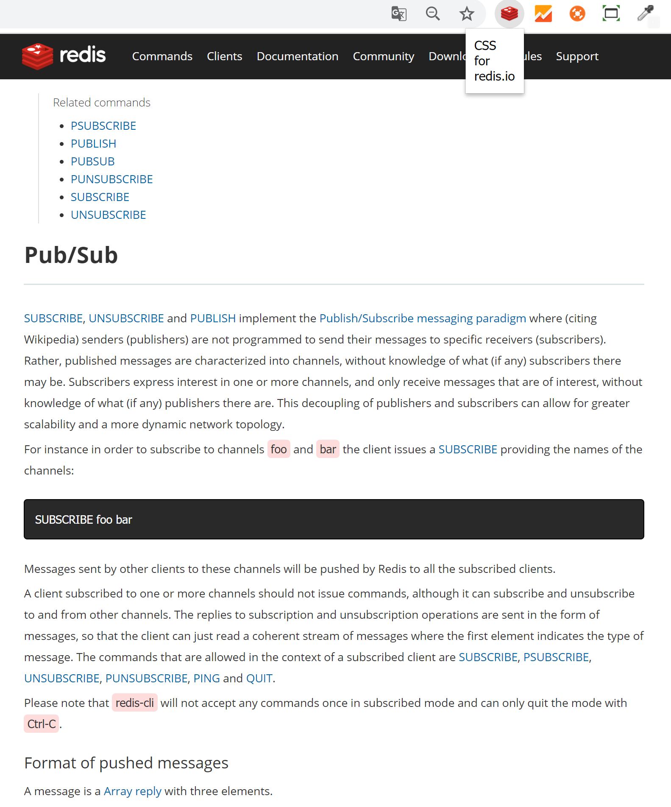

# css-for-redis.io

> Google Chrome Extension : CSS for redis.io

# Install Google Chrome Extension 

1. Clone/Download this source code 
2. Open the Extension Management page by navigating to `chrome://extensions`.
  - The Extension Management page can also be opened by clicking on the Chrome menu, hovering over `More Tools` then selecting `Extensions`.
3. Enable Developer Mode by clicking the toggle switch next to `Developer mode`.
4. Click the `LOAD UNPACKED` button and select the extension directory.

# Result 

# Dev Document

- [https://developer.chrome.com/extensions/getstarted](https://developer.chrome.com/extensions/getstarted)
